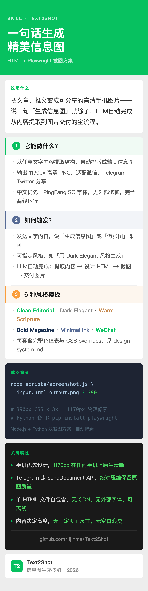

# Text2Shot

用 HTML + Playwright 高清截图，把文章、推文等任意内容生成专业手机信息图。

## 效果示例



## 它能做什么

当你说：

- "这篇文章生成一张信息图"
- "帮我做一张可以发微信群的总结图"
- "用 Dark Elegant 风格生成"

LLM 读取 skill，自动设计 HTML 排版（标题 → 摘要 → 问答块 → 引用 → 结语 → 页脚），再用 3x Retina 截图，输出适合手机查看的高清 PNG。

## 特性

- **6 套风格模板**：Clean Editorial、Dark Elegant、Warm Scripture、Bold Magazine、Minimal Ink、WeChat——每套含完整色值表与 CSS overrides
- **统一问答块**：多个编号章节共用一个容器，内嵌彩色徽章，空间利用率高
- **手机优先**：390px CSS 宽 × 3x = 1170px 物理像素，任何手机上原生清晰
- **中文优先**：使用系统 PingFang SC / Noto Sans SC，无外部字体依赖
- **自包含 HTML**：无 CDN、无 Google Fonts，完全离线运行
- **双截图方案**：Node.js 脚本 + Python 自动降级
- **Telegram 无损发送**：通过 `sendDocument` API 绕过 Telegram 图片压缩

## 风格模板

| # | 名称 | 风格 | 适合场景 |
|---|------|------|----------|
| 1 | **Clean Editorial** | 奶油底，彩色卡片，专业温暖 | 通用（默认） |
| 2 | **Dark Elegant** | 深色底，金色点缀，高级沉稳 | 夜间分享、正式内容 |
| 3 | **Warm Scripture** | 羊皮纸，深棕色，方角徽章 | 教会、圣经学习、灵修 |
| 4 | **Bold Magazine** | 全出血深色头图，扁平色块 | 社媒传播、强视觉冲击 |
| 5 | **Minimal Ink** | 纯白，大留白，无卡片 | 短内容、品质感优先 |
| 6 | **WeChat** | 微信绿，浮动白色卡片 | 微信群分享 |

每套模板的完整色值表与 CSS overrides 见 `references/design-system.md`。

## 使用方法

### 配合 LLM（推荐）

发送文字内容，说「生成信息图」或指定风格，LLM 读取 skill 自动处理一切。

### 独立使用

```bash
# 1. 编写 HTML 信息图（组件和模板见 references/design-system.md）

# 2. Node.js 高清截图
node scripts/screenshot.js input.html output.png 3 390
# → output.png 宽 1170px，3x DPI

# 3. 若 Node 脚本失败，改用 Python Playwright
python3 - <<'EOF'
from playwright.sync_api import sync_playwright
with sync_playwright() as p:
    browser = p.chromium.launch()
    ctx = browser.new_context(viewport={"width": 390, "height": 600}, device_scale_factor=3)
    page = ctx.new_page()
    page.goto("file:///path/to/input.html", wait_until="networkidle")
    page.locator("body").screenshot(path="output.png", type="png")
    browser.close()
EOF

# 4. （可选）无损发送到 Telegram
bash scripts/send_telegram.sh output.png "说明文字"
```

### 截图脚本参数

```
node scripts/screenshot.js <input.html> <output.png> [scaleFactor] [viewportWidth]

  scaleFactor     设备像素比（默认：3）
  viewportWidth   CSS 视口宽度，单位 px（默认：750）
```

## 文件结构

```
Text2Shot/
├── SKILL.md                  # LLM 读取的 skill 指令
├── README.md                 # 本文件
├── assets/                   # 示例图片
├── references/
│   └── design-system.md      # 色板、字体、问答块模板、6 套风格
└── scripts/
    ├── screenshot.js          # Playwright 高清截图工具（Node.js）
    └── send_telegram.sh       # Telegram 无损图片发送
```

## 环境要求

- **Node.js** v18+（截图脚本）
- **Playwright** Chromium：`npx playwright install chromium`
- **Python 3** + playwright pip 包（备用截图）：`pip install playwright && playwright install chromium`
- Telegram 发送需要：`curl` + Bot Token

## 设计原则

1. **可扫读，不可阅读**——信息图是被扫一眼的，不是被细读的
2. **视觉层级**——眼睛自然流动：标题 → 摘要 → 问答块 → 结语
3. **统一配色**——每个章节一个强调色，不随机混搭
4. **手机优先**——390px × 3x = 1170px 物理像素，手机上原生清晰
5. **自包含**——单 HTML 文件，无外部依赖

## 致谢

基于 [openclaw-skills](https://github.com/jincai/openclaw-skills) 中的 [infographic skill](https://github.com/jincai/openclaw-skills)，在此基础上扩展为独立工具。

## License

MIT
